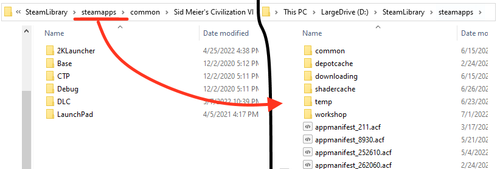
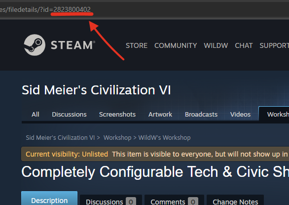
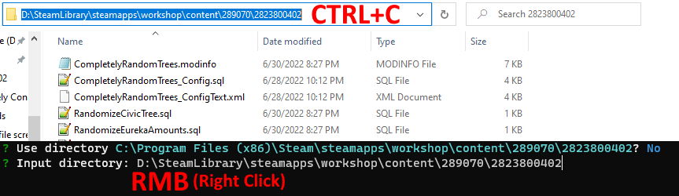

<div id="top"></div>
<!--
*** This README was made with https://github.com/othneildrew/Best-README-Template/blob/master/README.md

*** Thanks for checking out the Best-README-Template. If you have a suggestion
*** that would make this better, please fork the repo and create a pull request
*** or simply open an issue with the tag "enhancement".
*** Don't forget to give the project a star!
*** Thanks again! Now go create something AMAZING! :D
-->


<!-- PROJECT SHIELDS -->
<!--
*** I'm using markdown "reference style" links for readability.
*** Reference links are enclosed in brackets [ ] instead of parentheses ( ).
*** See the bottom of this document for the declaration of the reference variables
*** for contributors-url, forks-url, etc. This is an optional, concise syntax you may use.
*** https://www.markdownguide.org/basic-syntax/#reference-style-links
-->
[![Issues][issues-shield]][issues-url]
[![MIT License][license-shield]][license-url]


<!-- PROJECT LOGO -->
<br />
<div align="center">
  <a href="https://github.com/othneildrew/Best-README-Template">
    
  </a>

  <h3 align="center">Civ 6 Random Seeder</h3>

  <p align="center">
    A command-line app for easy management of Civilization VI randomizer mods
    <br />
    <br />
    Originally made for my mod <a href="https://steamcommunity.com/sharedfiles/filedetails/?id=2823800402">Completely Configurable Tech & Civic Shuffle Mode</a> but can be easily retooled to work for another random mod
    <br />
    <details>
      <summary>View Demo</summary>
      
    </details>
  </p>
</div>


<!-- TABLE OF CONTENTS -->
<details>
  <summary>Table of Contents</summary>
  <ol>
    <li>
      <a href="#about">About</a>
    </li>
    <li>
      <a href="#getting-started">Getting Started</a>
    </li>
    <li><a href="#usage">Usage</a></li>
    <li><a href="#license">License</a></li>
  </ol>
</details>


<!-- ABOUT -->
## About

<p align="center"></p>

Civ 6 Random Seeder is an app I designed to make random mods in Civ 6 a little less inconvenient. It was made with `node.js`, a JavaScript runtime environment.

<ul>
It accomplishes this by providing a streamlined way to automatically generate and store "random seeds", opposed to using your system's clock. (Such is a method with many of its own issues)

\
There also exists SQLite's `Random()` function which provides fantastic PRNG and can be used to order tables, but will re-roll whenever you reload the game and practically guarantees desync when used in multiplayer.

\
I do apologize for choosing Node, twas was a decision driven by familiarity. I forgot that to ship the app I'd need to package the entirety of Node and its modules into a single executable.

This results in an uncompressed total size of around 120 MB, when realistically this app should be a couple MB at most.
</ul>

<p align="center"></p>


<p align="right">(<a href="#top">back to top</a>)</p>


<!-- GETTING STARTED -->
## Getting Started

To install this app, either download the most recently published release that's compatible with your operating system, or install it through NPM.

_If you are not familar with NPM I would recommend downloading the app <a href="https://github.com/wildweegee101/Civ6-RandomSeeder/releases">here</a>, it's much less hassle._

### Direct Installation

_Follow these steps to install the app as an executable:_

1. Extract Civ6-RandomSeeder.zip to its own folder somewhere
2. Run Civ6-RandomSeeder.exe

### NPM Installation

_Follow these steps to install the app through NPM:_

1. [Install NPM & node.js](https://phoenixnap.com/kb/install-node-js-npm-on-windows) if you haven't already
2. Create a new folder where you wish to store the app

3. Open your newly created folder in a terminal

4. (Optional/Recommended) Install the civ6-randomseeder NPM package
   ```sh
   npm install civ6-randomseeder
   ```
5. Run civ6-randomseeder
   ```sh
   npx civ6-randomseeder
   ```
   * If you skipped installing the package, npx will temporarily install it globally
6. (Optional) Download this [batch file](other_files/start.bat) and place it in your directory
   * This file executes `npx civ6-randomizer` in the directory its placed in, think of it like a shortcut

<p align="right">(<a href="#top">back to top</a>)</p>


<!-- USAGE EXAMPLES -->
## Usage

#### Running this app will automatically generate two files in the immediate directory: `directory.txt` and `profiles.json`
* `directory.txt` stores the path to the mod (by default: C:\Program Files (x86)\Steam\steamapps\workshop\content\289070\2823800402)
* `profiles.json` stores user created "profiles" (a random seed with an accompanying title)
* You don't need to edit these files directly, the app will take care of that
* If for whatever reason, the app has trouble reading `profiles.json` and/or `directory.txt` and it cannot be resolved within the app itself, you may delete those files to let the app regenerate them
     * This will result in the loss of whatever data they stored, if this is an issue I would recommend opening the file to retrieve any important data before deletion

#### When prompted for a directory, know that the app is looking for _any_ valid directory that includes a file named `RandomSeed.sql`.
* This file will be found in any compatible mod's directory.

_Steam users you can find their Civ 6 workshop mod directory by following these steps:_

1. In your library, right click on Sid Meier's Civilization VI and navigate to `Manage -> Browse local files`


2. Navigate a couple levels back until you are in `steamapps`


3. Now enter `workshop/content/289070`
    * **289070** is the Steam game ID bestowed upon Civ 6, this folder is where all your workshop mods for Civ 6 are installed
4. Find & Enter the folder in this directory with the same name as the target mod's ID
    * You can find the ID of any workshop mod in the URL of their steam page
    
    * My mod: Completely Configurable Tech & Civic Shuffle Mode has the ID: **2823800402**
5. Copy the mod's directory and paste it into the command-line prompt



_If you're having trouble, shoot me a message over on [Discord](https://discordapp.com/users/187983990181986304)_

<p align="right">(<a href="#top">back to top</a>)</p>


<!-- LICENSE -->
## License

Distributed under the MIT License. See `LICENSE.txt` for more information.

I believe in collaboration, therefore this software is 100% free to use and repurpose, even in your own commercial projects. If you wish to, you can show some acknowlegment by forking this repo and/or crediting my name, but it is not required.

<p align="right">(<a href="#top">back to top</a>)</p>


<!-- MARKDOWN LINKS & IMAGES -->
<!-- https://www.markdownguide.org/basic-syntax/#reference-style-links -->
[issues-shield]: https://img.shields.io/github/issues/wildweegee101/civ6-randomseeder
[issues-url]: https://github.com/wildweegee101/Civ6-RandomSeeder/issues
[license-shield]: https://img.shields.io/github/license/wildweegee101/civ6-randomseeder
[license-url]: https://github.com/wildweegee101/Civ6-RandomSeeder/blob/master/LICENSE.txt
